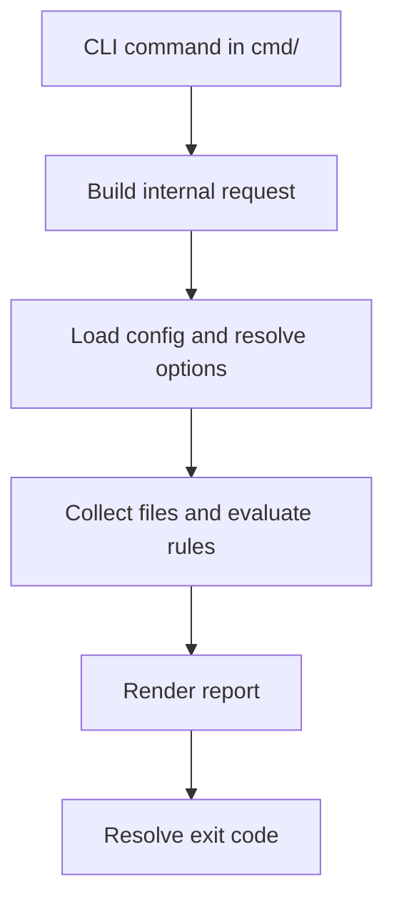

# Promptinel Architecture

This document explains how the repository is divided and how the main pieces fit together.
For step-by-step scan behavior, see [Scan Pipeline](./ScanPipeline.md).

## Design Constraints

The architecture is shaped by a few consistent constraints:

- command handlers should stay thin
- scan behavior should remain deterministic
- rule evaluation should be explicit and testable
- reporting should be separate from detection

## High-Level Flow

## Package Boundaries

`cmd`
Defines the CLI surface, parses flags, and calls internal behavior.

`internal/config`
Defines the typed configuration model, defaults, and validation.

`internal/files` and `internal/filters`
Resolve which files are scanned and how include and exclude globs behave.

`internal/scan`
Coordinates the shared scan workflow used by `scan` and the baseline commands.

`internal/engine`
Runs per-file analysis, applies trust and scope behavior, and preserves deterministic
ordering.

`internal/rules`
Defines rule contracts, compilation, and evaluation phases.

`internal/rules/builtin`
Contains built-in rule implementations and the built-in registry.

`internal/report`
Renders text, JSON, SARIF, baseline, and sanitize output.

`internal/baseline`
Builds and applies deterministic baseline snapshots.

`internal/exitcode`
Translates policy outcomes into process exit codes.

## Important Architectural Choices

### Thin Commands

Commands should parse input, build requests, call internal code, and render results. They
should not contain rule logic or core scan behavior.

### Shared Scan Pipeline

`scan` and baseline commands share most of the same execution path. That keeps file
selection, rule evaluation, and finding generation consistent across local use and CI
adoption flows. Baseline snapshots still use raw findings before policy `warn-on`
filtering.

### Deterministic Output

Concurrency is used to keep scans practical, but output order is still stable. This matters
for CI diffs, test coverage, and operator trust in the tool.

### Context-Aware Detection

Rules do not run in a vacuum. Detection can depend on modeled environment capabilities,
document trust, and scope overrides. That context is part of the architecture rather than an
afterthought.

## When To Read Next

- Read [Scan Pipeline](./ScanPipeline.md) if you are changing scan behavior
- Read [Trust Processing](./Trust.md) if you are changing provenance handling
- Read [Severity Handling](./Severity.md) if you are changing policy effects
- Read [Rule Architecture](./Rules.md) if you are adding or modifying rules
