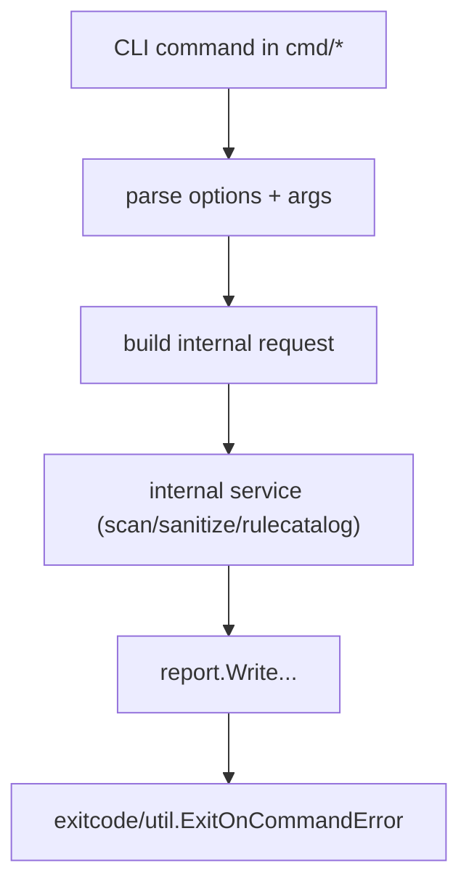
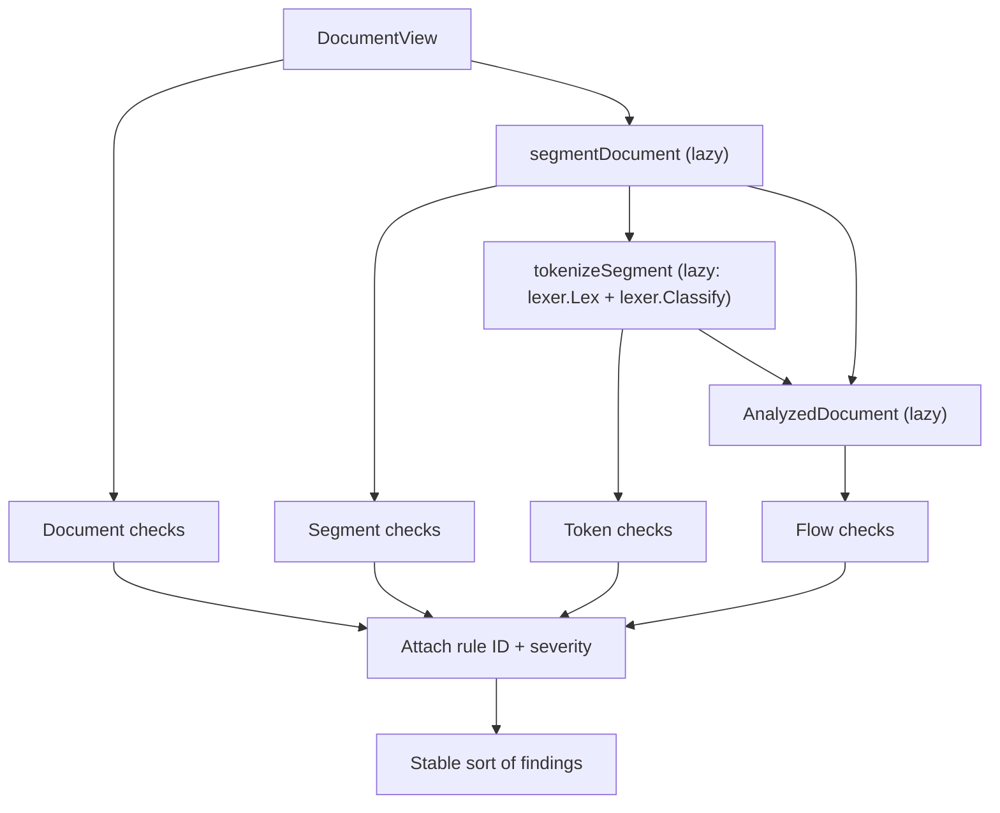

# Promptinel Architecture

Promptinel is a deterministic, static scanner for prompt files. The codebase is organized to keep CLI concerns thin,
isolate domain logic in `internal`, and make command execution predictable and extensible.

## High-Level Architecture

At runtime, commands in `cmd/` only orchestrate CLI flow: parse flags/args, build internal requests, call internal
services, render output, and map errors to process exit codes.

The key separation is:

- `cmd`: user interface, flag parsing, command wiring
- `internal/filters`: glob validation, config/CLI filter resolution, shared filter matching
- `internal/files`: shared file discovery, deduplication, and include/exclude projection for scan and sanitize
- `internal/scan`: reusable scan pipeline for `scan` and `baseline`
- `internal/sanitize`: file discovery and sanitize domain workflow
- `internal/rulecatalog`: built-in rule catalog listing and describing
- `internal/config`: typed config model, defaults, validation
- `internal/engine`: file collection/filtering plus per-file rule execution
- `internal/rules`: rule contracts, compilation, multi-phase evaluation
- `internal/lexer`: deterministic lexical + semantic tokenization with byte offsets
- `internal/exitcode`: policy threshold mapping to process codes

## Engine Design

`internal/engine.Scanner` is intentionally small and deterministic:

- resolves input paths
- recursively collects files (deduplicated via canonical path keys while preserving cleaned scan paths)
- applies include/exclude path filters
- reads file content in a bounded worker pool
- evaluates compiled rules with contextual metadata (path, environment, trust) per worker
- applies scope-based severity overrides from config
- returns file-qualified findings in stable file order

Important design choices:

- Context cancellation is supported (`context.Context`) and checked during file iteration.
- Paths are matched both relative to working directory and to input roots to reduce surprises in scope matching.
- Concurrent scanning is bounded by `GOMAXPROCS` and preserves deterministic output ordering.
- Engine logic avoids side effects beyond reading files, making behavior testable and reproducible.

## Rule System and Interfaces

The rule system is capability-based: a rule implements only the phases it needs.

Core interfaces in `internal/rules/rule.go`:

- `Rule`: metadata only (`Metadata() Metadata`)
- `DocumentRule`: whole-file checks (`CheckDocument`)
- `SegmentRule`: structural-segment checks (`CheckSegment`)
- `TokenRule`: lexical checks (`CheckTokens`)
- `FlowRule`: full analyzed-document checks (`CheckFlow`)

`Token` values provided to `TokenRule` include:

- semantic `Type` (`lexer.TokenType`)
- `Value`
- byte `Start`/`End` offsets
- line/column `Position`

Compilation in `internal/rules/registry.go` binds configured severity and enabled-state into `CompiledRule` values. Each
compiled rule stores only the phase callbacks actually implemented by that rule.

This avoids no-op methods and keeps extension ergonomic: new rules can be narrowly scoped to one phase or span multiple
phases.

## Context-Aware Rule Behavior

`rules.Context` is a first-class input to built-in detection and is used with three patterns:

- Environment-only effects:
  rules that depend on runtime capabilities short-circuit when the capability is disabled.
  Examples: shell-driven rules (`no-command-chaining`), network-driven rules
  (`no-insecure-http`, `no-metadata-service-access`), and filesystem-driven rules
  (`no-sensitive-file-paths`).
- Trust-only effects:
  trust level can tighten matching even when environment capabilities are unchanged.
  Example: `no-prompt-injection-override` always matches strong override phrases and adds
  weaker phrase matching for `untrusted`/`tainted` sources.
- Combined effects (environment + trust):
  some rules use both capability and trust to decide whether and how to match.
  Example: `no-secret-exfiltration-intent` requires both network access and secret
  availability, then expands its token-distance window only for `untrusted`/`tainted`
  inputs.

This model keeps detections aligned with the configured deployment environment while
remaining conservative for lower-trust inputs.

## Rule Evaluation Pipeline

`rules.Evaluate(...)` executes rules in deterministic phase order with lazy preparation:

Key decisions:

- Segments/tokens/analyzed document are built lazily so phases incur cost only when needed.
- Rule metadata is attached after callbacks, centralizing severity and ID assignment.
- Findings are stably sorted (`rule ID`, `line`, `column`, `message`) to guarantee deterministic output.

## Lexer Architecture

Tokenization is implemented in `internal/lexer` and is explicitly deterministic and offline:

- single-pass UTF-8 lexing (`lexer.Lex`) without global `[]rune` conversion
- exact byte offsets on every token
- explicit detection for zero-width and control characters
- semantic post-processing (`lexer.Classify`) for URLs, placeholders, base64-like values, shell commands, paths, and code blocks
- Unicode grapheme segmentation helper via `github.com/rivo/uniseg` (`Graphemes`)

The rules layer consumes these tokens; it does not perform raw-string lexical tokenization.

## Built-In and Custom Rules

Built-ins are composed in `internal/rules/builtin` and registered centrally (`builtin.NewRegistry`).

Current built-in examples:

- `no-bidi-control-characters` (document phase): detects bidirectional control characters used for visual obfuscation
- `no-hidden-html-instructions` (document phase): flags suspicious instructions hidden inside HTML comments
- `no-zero-width` (token phase): detects zero-width tokens emitted by the lexer
- `no-unsafe-templates` (token phase over template segments): detects risky execution/exfiltration signals in template expressions
- `no-secret-to-network-flow` (flow phase): detects secret-source plus exfiltration action plus outbound sink chains

Custom regex rules are compiled from config (`custom-rules`) into first-class token-phase rule implementations,
validated for regex correctness and duplicate IDs. Regex matching is performed on `Token.Value` rather than on raw file
content.

## Configuration and Policy Decisions

`internal/config` enforces strict invariants before scanning:

- severity and trust enum validation
- policy ordering (`fail-on >= warn-on`)
- scope glob validation
- uniqueness of built-in override IDs and custom-rule IDs

Defaults are security-oriented (high capability environment assumptions, conservative trust levels) so scanning remains
useful even without a config file.

## Exit Semantics

`internal/exitcode.Resolve` maps the highest finding severity against policy thresholds:

- `0`: no actionable findings
- `1`: warning threshold reached
- `2`: failure threshold reached

Commands return typed `exitcode.Error` values so process exit mapping stays centralized in `util.ExitOnCommandError`.

`internal/scan.Result` now distinguishes:

- `RawFindings`: all findings before `policy.warn-on` filtering
- `ReportableFindings` (and compatibility alias `Findings`): findings after `policy.warn-on` filtering

`scan` command reporting and exit-policy evaluation operate on reportable findings, while baseline snapshot generation
uses raw findings to preserve accepted findings across severity thresholds.

## Notable Tradeoffs and Next Steps

Current tradeoffs:

- Files are read fully in memory per target file (simple and fast for typical prompt files).
- Deterministic lexical/template analysis over probabilistic/NLP behavior.
- Terminal-friendly text output over machine-readable reporting formats.

Natural next architecture steps:

- add JSON/SARIF output modes
- expand flow-level rules for deeper cross-segment reasoning
- add configurable worker limits
