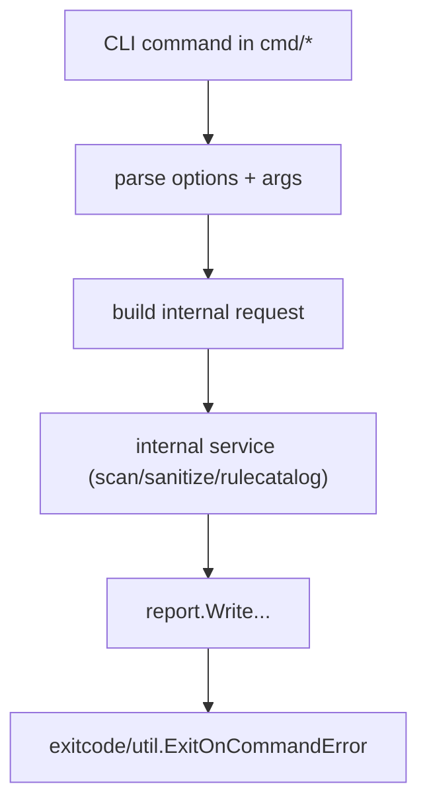

# Promptinel Architecture

This document describes the implemented architecture of Promptinel and the near-term roadmap.

## Related Documents

The architecture overview is intentionally short. Use these companion documents for the parts that
carry the most policy and implementation detail:

- [Scan Pipeline](./ScanPipeline.md)
- [Configuration And Precedence](./Config.md)
- [Trust Processing](./Trust.md)
- [Severity Handling](./Severity.md)
- [Rule Architecture](./Rules.md)

## Architecture Doc Changelog

- 2026-02-28: Split content into `Current State` and `Planned Roadmap`; documented machine-readable `scan` outputs (`json`, `sarif`) and deterministic ordering guarantees; removed outdated "future" claims that are now implemented.

## Current State (Implemented)

### High-Level Runtime Flow

Commands in `cmd/` are intentionally thin: parse CLI flags and args, build internal requests,
call internal services, render output, and map errors to process exit codes.

### Package Boundaries

- `cmd`: command wiring, flag parsing, CLI orchestration
- `internal/config`: typed config model, defaults, validation
- `internal/filters`: glob validation and include/exclude resolution
- `internal/files`: shared file discovery and deterministic target collection
- `internal/scan`: shared scan workflow used by `scan` and `baseline`
- `internal/engine`: concurrent per-file scanning and scope override application (scope severity + field-wise per-rule overrides)
- `internal/rules`: rule contracts, compilation, and deterministic phase-based evaluation
- `internal/rules/builtin`: built-in security rule implementations and registry
- `internal/lexer`: UTF-8 lexical analysis and token classification
- `internal/report`: text/JSON/SARIF rendering and sanitize/baseline report text
- `internal/baseline`: baseline snapshot creation and filtering
- `internal/exitcode`: policy threshold to process exit code mapping

### Scan Pipeline

`internal/scan.Run` performs:

1. configuration load (explicit file or optional discovery)
2. built-in/custom rule compilation
3. scanner execution through `internal/engine`
4. separation into:
   - `RawFindings` (pre-`warn-on` filtering)
   - `ReportableFindings` (post-`warn-on`, excluding oversized skips)
   - `OversizedSkippedFindings` (always informational)

`scan` command behavior:

- applies optional baseline suppression to `ReportableFindings`
- resolves policy outcome from post-baseline reportable findings
- renders selected output format
- exits with policy-derived code (`PASS=0`, `WARN=1`, `FAIL=2`)

### Concurrency and Cancellation

`internal/engine.Scanner` uses a bounded worker pool based on `GOMAXPROCS` and preserves deterministic output order.

Cancellation behavior:

- command context (`cmd.Context()`) is propagated into scan execution
- scheduling stops promptly after cancellation is observed
- in-flight work is best-effort and not forcibly preempted

### Rule Execution Model

Rules are capability-based via phase-specific interfaces:

- `DocumentRule`
- `SegmentRule`
- `TokenRule`
- `FlowRule`

`rules.Evaluate` performs deterministic phase order and stable finding sort (`rule ID`, `line`, `column`, `message`) with lazy segment/token/analyzed-document construction.

### Context-Aware Rule Behavior

`rules.Context` is consumed by built-ins with:

- environment-only effects (capability gating)
- trust-only effects (stricter matching for lower-trust regions, not just whole files)
- combined environment + trust effects
- scanner-derived per-document metadata for targeted advisory checks such as `SKILL.md` bundled-resource detection

This keeps detection aligned to deployment capability assumptions while remaining conservative for untrusted/tainted inputs.

Trust is modeled as a base document level plus lower-trust provenance spans. The current
implementation overlays user-input placeholder regions onto otherwise trusted files so rules can
query the effective trust of the exact range they inspect. The span model also leaves room for
future remote-include provenance without changing rule APIs again.

### Scope Override Precedence

Scope resolution uses deterministic **Last-Match-Wins** semantics:

- all scopes that match a file path are considered in declaration order
- later matching scopes override earlier matching scopes
- this applies to scope-level `severity` and per-rule entries in `scopes[].rules[]` for the same rule `id`

Effective precedence per finding is:

1. compiled global rule config (`rules[]`)
2. effective scope `severity`
3. effective per-rule scope override (`scopes[].rules[]`)

### Output Architecture

`scan` supports three output modes (`--output`):

- `text`: human-readable grouped findings + summary
- `json`: Promptinel schema with `schema_version: "1.0.0"`
- `sarif`: SARIF 2.1.0 for code-scanning ingestion

Deterministic ordering guarantees:

- findings are grouped and sorted by `path` + `rule_id`
- line lists are deduplicated and numerically sorted
- SARIF descriptors are sorted by rule ID

Compatibility expectations:

- JSON schema version follows additive compatibility rules within major version `1`
- SARIF output targets the SARIF 2.1.0 schema and keeps stable rule IDs

### Policy and Exit Semantics

`internal/exitcode.Resolve` maps highest severity in reportable findings to configured policy thresholds.

- oversized-file skips (`scan-file-too-large`) remain informational and do not affect exit codes
- unreadable-file skips may appear as low-severity findings and remain subject to policy filtering

## Planned Roadmap (Not Yet Implemented)

- configurable worker-count override in scanner settings
- richer cross-segment flow analysis and additional flow rules
- optional machine-readable outputs for `sanitize` and baseline commands
