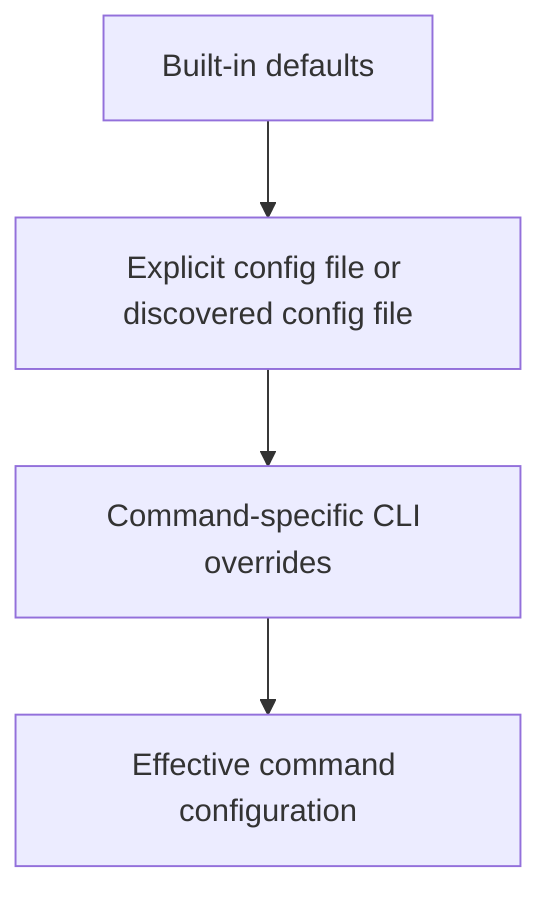
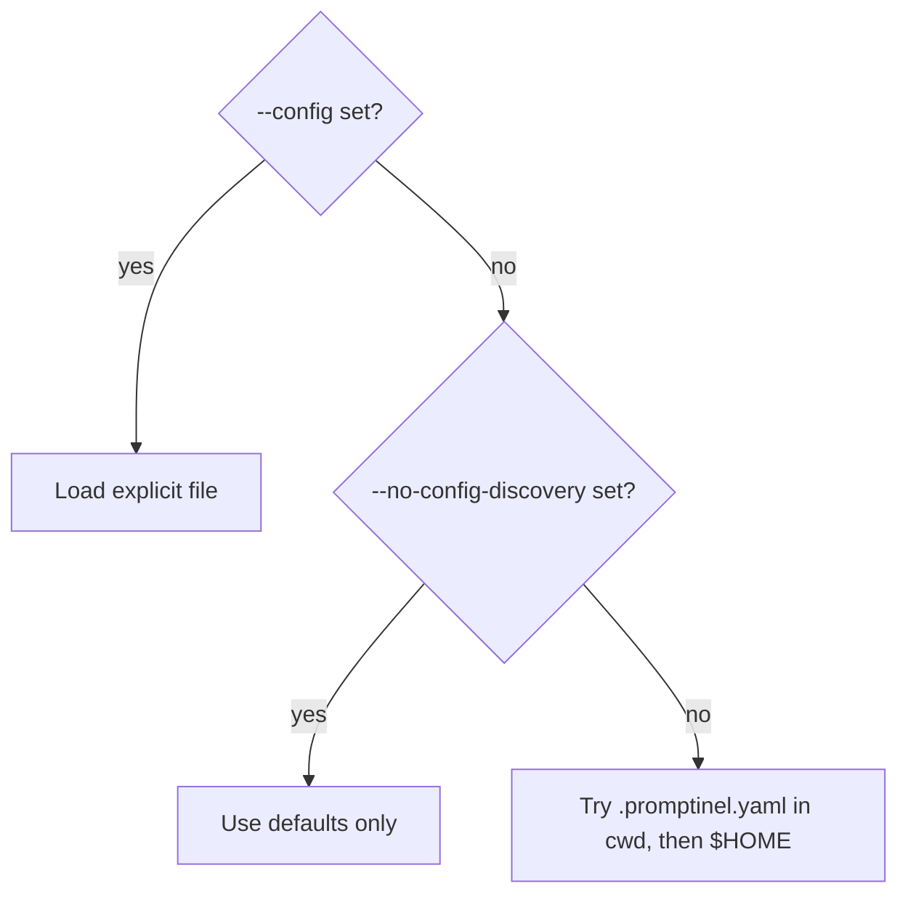
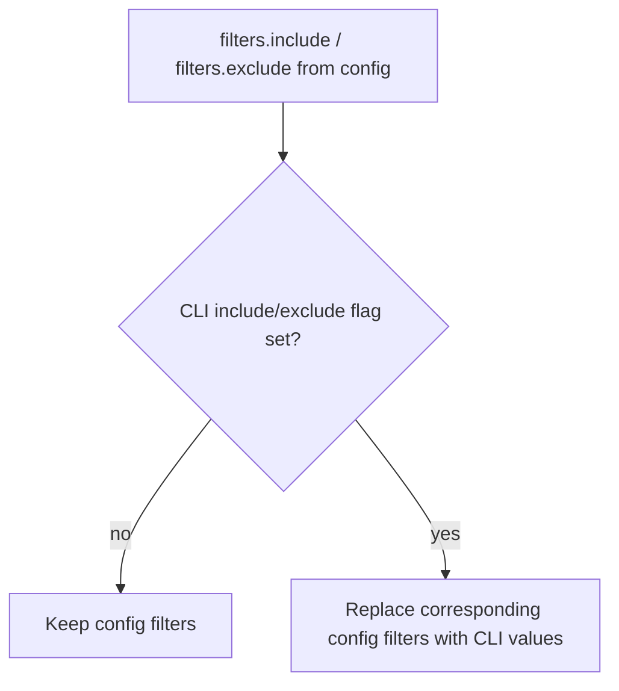
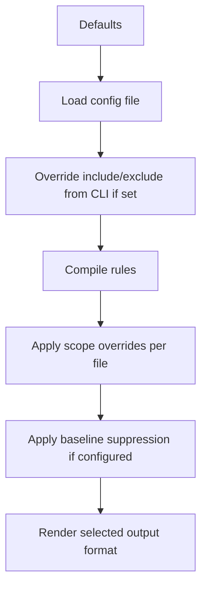

# Configuration And Precedence

This document explains how Promptinel loads configuration and how it resolves conflicts between
defaults, config files, scopes, and CLI arguments.

## Sources Of Configuration

Promptinel can get effective settings from four places:

1. built-in defaults
2. an explicitly selected config file via `--config`
3. an implicitly discovered `.promptinel.yaml`
4. CLI flags on the command being run

Not every command exposes every override. The important rule is that Promptinel starts with
defaults, optionally loads one config file, and then applies command-specific CLI overrides.



## Built-In Defaults

If no config file is loaded, Promptinel uses secure defaults from `internal/config.DefaultConfig()`.

Examples of those defaults include:

- `policy.fail-on: high`
- `policy.warn-on: medium`
- full environment capabilities enabled
- `trust.local-files: trusted`
- `trust.remote-includes: untrusted`
- `trust.user-input-placeholders: tainted`
- empty include and exclude filters
- no scopes
- no rule overrides
- no custom rules

## Config File Loading

### Explicit Config File

If `--config <path>` is provided, Promptinel loads exactly that file.

This wins over discovery behavior. Even when `--no-config-discovery` is also present, an explicit
config path is still loaded.

### Implicit Discovery

If `--config` is not provided and discovery is enabled, Promptinel looks for `.promptinel.yaml`:

- in the current directory
- in `$HOME`

If no config file is found, Promptinel falls back to built-in defaults.

### Disabling Discovery

If `--no-config-discovery` is set and `--config` is not set, Promptinel uses defaults only.

This is the cleanest way to guarantee that local or home-directory config does not affect a run.



## CLI Versus Config File

Promptinel does not merge arbitrary config keys from the CLI. Only specific flags override specific
config-backed settings.

Today, the shared CLI override behavior is:

- `--config` chooses which config file to load
- `--no-config-discovery` disables implicit file discovery
- `--include` overrides `filters.include`
- `--exclude` overrides `filters.exclude`

Other command flags such as `--output`, `--baseline`, `--file`, and `--apply` are command options,
not config-file fields.

## Include And Exclude Precedence

File filters use an explicit override model:

- if `--include` is not set, Promptinel uses `filters.include` from config
- if `--exclude` is not set, Promptinel uses `filters.exclude` from config
- if either CLI flag is set, that flag replaces the corresponding config value

That replacement is complete, not additive.



For example, if the config contains:

```yaml
filters:
  include:
    - "*.md"
  exclude:
    - "*.yaml"
```

and the CLI command is:

```bash
promptinel scan --include "*.txt" prompts/
```

then the effective filters are:

- include: `["*.txt"]`
- exclude: `["*.yaml"]`

There is currently no dedicated CLI syntax for "clear the configured include/exclude list but keep
the other side unchanged." A repeated flag replaces the corresponding config value with the values
provided on the command line.

## How Globbing Works

Promptinel uses glob patterns for both `filters.include` / `filters.exclude` and `scopes[].path`.

The matcher combines two behaviors:

- standard `filepath.Match` syntax such as `*`, `?`, and character classes like `[ab]`
- recursive `**` path segments, where `docs/**` matches `docs/file.md` and `docs/nested/file.md`

Path separators are normalized to `/` before matching, so the same pattern works across platforms.

### What A Pattern Is Matched Against

For include and exclude filters, Promptinel first computes a path relative to the current working
directory when possible.

It then tries the glob against:

- the relative path, such as `docs/prompt.md`
- the file basename, such as `prompt.md`

The basename fallback is important. A pattern like `*.md` matches Markdown files in nested
directories too, because `docs/prompt.md` does not match `*.md` as a full path, but its basename
`prompt.md` does.

For scopes, the same glob matcher is used, but matching is path-based only. In practice, scope
patterns should usually describe directories or relative file paths such as `docs/**` or
`agents/review.md`.

### Include And Exclude Semantics

Globbing is applied in this order:

1. if there are no include patterns, the file starts as included
2. if include patterns exist, at least one of them must match
3. if any exclude pattern matches, the file is excluded even if an include matched

This means excludes always win.

### Examples

```yaml
filters:
  include:
    - "*.md"
    - "docs/**"
  exclude:
    - "docs/archive/**"

scopes:
  - path: "docs/security/**"
    severity: high
```

With that configuration:

- `README.md` is included by `*.md`
- `docs/guide/intro.txt` is included by `docs/**`
- `docs/archive/old.md` is excluded because exclude patterns override includes
- `docs/security/model.md` matches the scope path `docs/security/**`

## Command-Specific Effective Settings

### `scan`

`scan` uses:

- config loading and discovery behavior
- effective include and exclude filters
- policy settings
- environment settings
- trust settings
- limits
- scopes
- built-in rule overrides
- custom rules

It also has CLI-only options:

- `--baseline`
- `--output`

These do not come from `.promptinel.yaml`.

### `sanitize`

`sanitize` uses:

- config loading and discovery behavior
- effective include and exclude filters
- limits

`sanitize` does not use scan policy, rule evaluation, or baseline behavior. Its `--apply` flag is
CLI-only.

### `baseline create` and `baseline update`

Baseline commands use the same shared scan configuration as `scan`:

- config loading and discovery behavior
- effective include and exclude filters
- rules
- scopes
- trust
- environment
- limits

Their baseline file path is controlled by the CLI `--file` flag, not by config.

## Precedence Inside The Config Model

Once a config file is loaded, Promptinel still resolves several layers of precedence internally.

### Policy

Policy values come from:

1. defaults
2. config file

There are currently no CLI flags that override `policy.fail-on` or `policy.warn-on`.

### Environment

Environment capability flags come from:

1. defaults
2. config file

There are currently no CLI flags that override environment capabilities.

### Trust

Trust values come from:

1. defaults
2. config file

There are currently no CLI flags that override trust settings.

### Rules

For built-in rules, effective enablement and severity are resolved in this order:

1. built-in rule metadata
2. config `rules[]`
3. matching config `scopes[].severity`
4. matching config `scopes[].rules[]`

Custom regex rules start from their own `custom-rules[]` severity and then follow the same
scope-based overrides.

### Scopes

Scopes use last-match-wins semantics:

- all matching scopes are considered
- matches are merged in declaration order
- later matches override earlier ones

This applies to both scope-wide severity and per-rule scope overrides.

## Practical Precedence Summary

For a normal `scan` run, the simplest mental model is:

1. start with built-in defaults
2. load one config file, either explicit or discovered
3. replace include and exclude filters if the CLI flags were set
4. compile rules with config-level overrides
5. apply scope overrides per file
6. apply baseline suppression if `--baseline` was provided
7. render output in the CLI-selected format



## When To Use Which Mechanism

- use `.promptinel.yaml` for repository policy and stable team defaults
- use `--config` when testing an alternate config file or running in CI with an explicit path
- use `--no-config-discovery` when you need reproducible defaults-only behavior
- use `--include` and `--exclude` for one-off targeting on top of the chosen config source
- use scopes when the override should depend on file paths rather than on a specific CLI run
