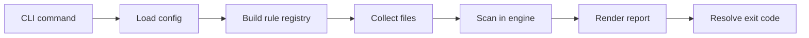
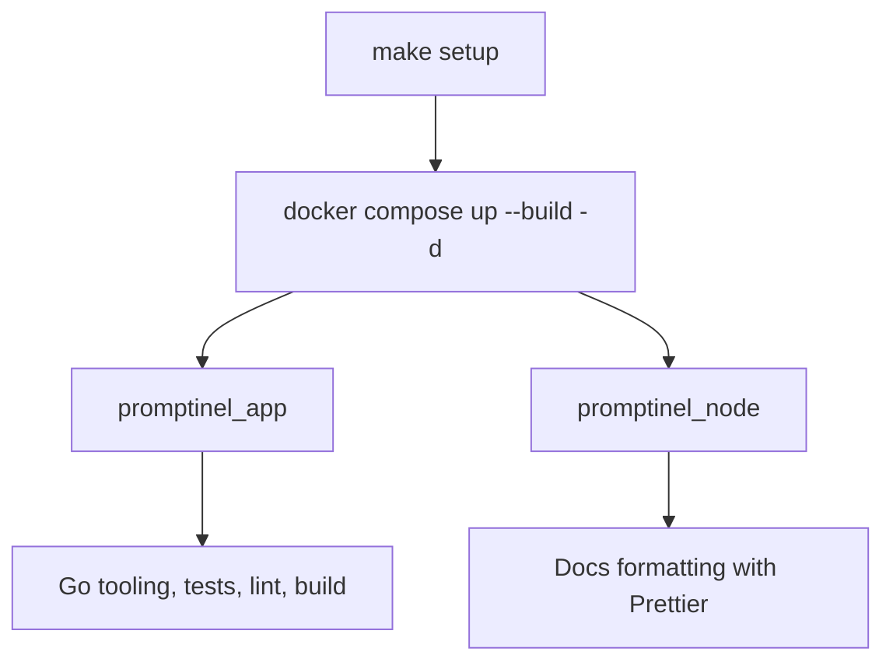
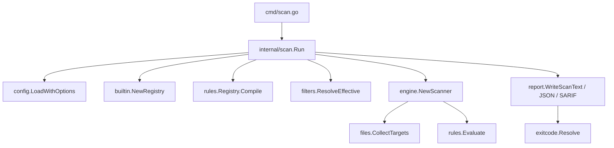
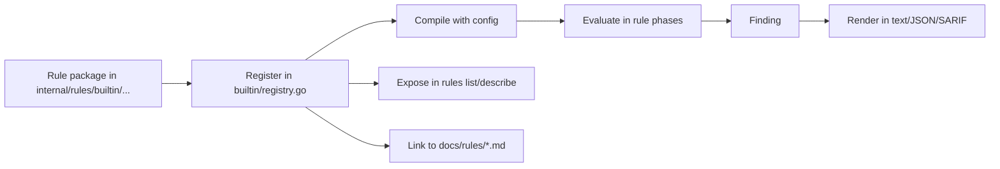

# Promptinel Onboarding

## Purpose

Promptinel is a Go CLI that statically scans machine-interpreted natural language for risky instructions before an LLM
or agent executes them.

The project is intentionally:

- deterministic
- offline-first
- CI-friendly
- conservative about trust and capability assumptions

On a high level, there are three main command categories:

- `cmd/` for Cobra command wiring
- `internal/` for scan, sanitize, reporting, config, and rule logic
- `docs/` for architecture and per-rule documentation

For the current documentation map, see the [Documentation Index](./README.md).

## Tech Stack

- Language: Go
- CLI framework: `github.com/spf13/cobra`
- Config loading: `github.com/spf13/viper`
- Test assertions: `github.com/stretchr/testify`
- Terminal formatting: `github.com/fatih/color`
- Dev environment: Docker Compose via [`compose.yml`](../compose.yml)

## What The CLI Does

The implemented command surface is:

- `promptinel scan [path ...]`
- `promptinel sanitize [path ...]`
- `promptinel baseline create|update [path ...]`
- `promptinel rules list|describe`

Command packages stay thin. The expected pattern is:

1. parse flags in `cmd/*`
2. build an internal request
3. call an `internal/...` package
4. render output
5. let `util.ExitOnCommandError(...)` map failures to process exit codes

Example from [`cmd/scan.go`](../cmd/scan.go):

```go
var scanCmd = &cobra.Command{
	Use:   "scan [path ...]",
	Args:  cobra.MinimumNArgs(1),
	Run: func(cmd *cobra.Command, args []string) {
		util.ExitOnCommandError("scan command failed", runScan(cmd, args))
	},
}
```

This project explicitly prefers `Run`, not `RunE`, for Cobra commands.

## Directory Map

### Root

- [`main.go`](../main.go): CLI entry point
- [`go.mod`](../go.mod): Go module and pinned dependencies
- [`Makefile`](../Makefile): standard developer commands
- [`compose.yml`](../compose.yml): local dev containers
- [`.promptinel.yaml`](../.promptinel.yaml): repository default scanner
  config

### Commands

- [`cmd/`](../cmd): Cobra command definitions, flag parsing, command tests

Key files:

- [`cmd/root.go`](../cmd/root.go): root command and version handling
- [`cmd/scan.go`](../cmd/scan.go): scan command and output selection
- [`cmd/sanitize.go`](../cmd/sanitize.go): sanitize command
- [`cmd/baseline.go`](../cmd/baseline.go): baseline lifecycle
- [`cmd/rules.go`](../cmd/rules.go): built-in rule discovery and rule help
- [`cmd/flags_shared.go`](../cmd/flags_shared.go): shared `--config`,
  `--include`, `--exclude`, `--no-config-discovery`

### Core Runtime

- [`internal/config/`](../internal/config): typed config model, defaults,
  validation
- [`internal/files/`](../internal/files): deterministic file collection and
  skip handling
- [`internal/filters/`](../internal/filters): glob validation and filter
  resolution
- [`internal/scan/`](../internal/scan): shared scan pipeline for `scan` and
  baseline commands
- [`internal/engine/`](../internal/engine): concurrent per-file scanning,
  trust spans, scope overrides
- [`internal/rules/`](../internal/rules): rule contracts, compilation,
  evaluator
- [`internal/rules/builtin/`](../internal/rules/builtin): built-in rules
- [`internal/report/`](../internal/report): text, JSON, SARIF, baseline, and
  sanitize rendering
- [`internal/baseline/`](../internal/baseline): baseline snapshot hashing,
  filtering, atomic writes
- [`internal/sanitize/`](../internal/sanitize): safe normalization workflow
- [`internal/exitcode/`](../internal/exitcode): policy threshold to exit code
  mapping

### Documentation

- [`docs/Architecture.md`](../docs/Architecture.md): package boundaries and
  runtime model
- [`docs/ScanPipeline.md`](../docs/ScanPipeline.md): scan lifecycle
- [`docs/Trust.md`](../docs/Trust.md): trust levels and span overlay model
- [`docs/Rules.md`](../docs/Rules.md): rule phases and rule authoring
- [`docs/rules/`](../docs/rules): per-rule user-facing docs

### Tests

- [`cmd/*_test.go`](../cmd): command behavior only
- [`internal/*/*_test.go`](../internal): package-level logic tests
- [`e2e/`](../e2e): end-to-end tests

## First Mental Model

Treat Promptinel as a pipeline:

```text
CLI -> config -> rule registry -> file collection -> engine -> report -> exit code
```



The shared scan pipeline in [`internal/scan/scan.go`](../internal/scan/scan.go) is responsible for:

1. load config
2. build built-in rule registry
3. compile built-in and custom rules
4. collect target files
5. scan files concurrently
6. split raw findings from reportable findings

That separation matters:

- `scan` uses `ReportableFindings`
- baseline creation uses `RawFindings`
- oversized file skips are surfaced separately and remain informational

`promptinel scan` then performs command-specific work in
[`cmd/scan.go`](../cmd/scan.go):

1. optionally apply baseline suppression
2. render text, JSON, or SARIF output
3. resolve the final exit code

## Local Setup

### Prerequisites

- Docker and Docker Compose

The project is set up to run its toolchain inside containers.
The Go container is defined in [`.docker/go/Dockerfile`](../.docker/go/Dockerfile), and the docs/formatting
container is defined in [`.docker/node/Dockerfile`](../.docker/node/Dockerfile).



### Start The Environment

```bash
make setup
```

This starts the containers from [`compose.yml`](../compose.yml):

- `promptinel_app`: Go toolchain and development tools
- `promptinel_node`: Node/Prettier tooling profile

If you only need the running app container later:

```bash
make up
```

To stop everything:

```bash
make down
```

### Useful Shell Access

```bash
make shell
```

## Daily Development Commands

Before opening a PR, run:

```bash
make fmt fix vet vuln lint test
```

Other useful commands:

```bash
make coverage
make logs
go run main.go --version
go run main.go scan .
go run main.go rules list
```

Get a list of all Make commands with:

```bash
make help
```

Notes:

- `make test` includes Docker setup checks, core tests, and e2e tests.
- `make fmt-docs` uses Prettier via the Node tooling container.
- `make build` requires `BUILD_VERSION` and writes the binary to `build/promptinel`.
- The repository instructions prefer `go run main.go` over `make run`.

## Configuration Basics

Promptinel loads secure defaults from [
`internal/config/config.go`](../internal/config/config.go). If you do not
pass `--config`, it can auto-discover `.promptinel.yaml` from the current directory and `$HOME`.

The repository contains a local config in [
`.promptinel.yaml`](../.promptinel.yaml):

```yaml
policy:
  fail-on: high
  warn-on: medium

scopes:
  - path: docs/**
    severity: low
```

Important implications:

- docs are scanned at reduced severity because of the `docs/**` scope
- `--no-config-discovery` is the fastest way to test built-in defaults only
- CLI include/exclude flags override config filters when explicitly set

## Key Concepts You Need Early

### 1. Determinism Is A Core Requirement

Many packages are designed around stable output:

- file discovery is deterministic
- rules are compiled and listed in stable order
- findings are sorted by rule ID, line, column, and message
- machine-readable output is expected to remain stable

This is why code often prefers explicit sorting and stable merge behavior over clever shortcuts.

### 2. Environment Capabilities Affect Detection

Rules inspect capability flags from config:

- `can_execute_shell`
- `can_access_filesystem`
- `can_access_network`
- `has_secrets`

Example from [
`internal/rules/builtin/no_curl_pipe_shell/rule.go`](../internal/rules/builtin/no_curl_pipe_shell/rule.go):

```go
if !ctx.CanAccessNetwork() || !ctx.CanExecuteShell() {
	return nil
}
```

That means some detections intentionally disappear when the modeled runtime cannot perform the risky action.

### 3. Trust Changes Matching Strictness

Promptinel uses:

- `trusted`
- `untrusted`
- `tainted`

The engine overlays lower-trust spans onto a file instead of forcing an entire document into one trust bucket.
Placeholder regions are the main trust-span source today. See [
`internal/engine/trust.go`](../internal/engine/trust.go) and [
`docs/Trust.md`](../docs/Trust.md).

### 4. Scopes Use Last-Match-Wins

Scope overrides are deterministic:

- all matching scopes apply
- later matches override earlier matches
- per-rule scoped overrides can change severity or disable a rule entirely

This behavior is covered heavily in [
`internal/engine/engine_test.go`](../internal/engine/engine_test.go).

## How Scanning Works

When you run:

```bash
go run main.go scan prompts/
```

the path through the code is roughly:

1. [`cmd/scan.go`](../cmd/scan.go) parses flags and creates a request
2. [`internal/scan/scan.go`](../internal/scan/scan.go) loads config and
   compiles rules
3. [`internal/files/files.go`](../internal/files/files.go) collects files and
   skip reasons
4. [`internal/engine/engine.go`](../internal/engine/engine.go) scans files
   concurrently
5. [`internal/rules/rule.go`](../internal/rules/rule.go) evaluates rule
   phases
6. [`internal/report/scan_text.go`](../internal/report/scan_text.go) renders
   findings
7. [`internal/exitcode/exit_code.go`](../internal/exitcode/exit_code.go)
   decides `PASS`, `WARN`, or `FAIL`



`scan` supports three output modes:

- `text`
- `json`
- `sarif`

## How Sanitizing Works

`sanitize` is narrower than `scan`. It only performs safe transformations, primarily normalization work such as removing
invisible characters.

The implementation is in [
`internal/sanitize/sanitize.go`](../internal/sanitize/sanitize.go).

Key behavior:

- dry-run by default
- `--apply` writes files atomically
- symlinks and non-regular files are skipped
- files over `limits.max_file_size_bytes` are skipped

Try it with:

```bash
go run main.go sanitize docs/
go run main.go sanitize --apply docs/
```

## How Baselines Work

Baseline support exists to help teams adopt Promptinel in CI without fixing every historical finding at once.

Commands:

```bash
go run main.go baseline create
go run main.go baseline update
go run main.go scan --baseline .promptinel-baseline.json .
```

Key implementation details:

- baseline snapshots are built from raw findings, not post-policy findings
- entries are hashed deterministically
- writes are atomic

See [`internal/baseline/baseline.go`](../internal/baseline/baseline.go).

## Rule System Overview

Rules implement `Metadata()` plus at least one evaluation phase:

- `DocumentRule`
- `SegmentRule`
- `TokenRule`
- `FlowRule`

The evaluator is phase-ordered and lazy. It only builds segments, tokens, or analyzed documents if some compiled rule
actually needs them.

Built-in rules are registered in [
`internal/rules/builtin/registry.go`](../internal/rules/builtin/registry.go).



If you add or change a built-in rule:

1. implement the rule in `internal/rules/builtin/<rule>/`
2. add targeted tests
3. register it in the built-in registry
4. add or update the matching doc in `docs/rules/`
5. update [`docs/rules/Overview.md`](../docs/rules/Overview.md)

If the behavior only needs a project-specific regex, consider `custom-rules` in config before adding Go code.

## Testing Strategy

The test suite is broad and follows the project naming convention:

- `Test_Cmd_...` for CLI tests
- `Test_Engine_...` for engine behavior
- package-specific names for rules and helpers

What to know:

- `cmd` tests cover CLI behavior, not reusable algorithms
- reusable logic belongs in `internal/...` and should be tested there
- many tests assert deterministic ordering, scope precedence, and config behavior
- there is an e2e SARIF test in [
  `e2e/scan_sarif_e2e_test.go`](../e2e/scan_sarif_e2e_test.go)

Good starting points:

- [`cmd/scan_test.go`](../cmd/scan_test.go)
- [`internal/engine/engine_test.go`](../internal/engine/engine_test.go)
- [`internal/scan/scan_test.go`](../internal/scan/scan_test.go)
- [`internal/report/report_test.go`](../internal/report/report_test.go)

Coverage expectation from the project docs: keep new or changed code at `85%+`, and explain any shortfall in the PR.

## CI And Release Notes

The main CI workflow is [
`.github/workflows/ci.yml`](../.github/workflows/ci.yml).

It currently:

- sets up Go
- runs `go mod tidy` and `go mod vendor`
- runs core tests with coverage, race detection, and shuffle enabled
- runs `golangci-lint`
- runs `go vet`
- runs `govulncheck`
- builds the binary with `BUILD_VERSION`

There are separate workflows for e2e, SARIF, release, and PR title validation.

## Common Contributor Tasks

### Add A New CLI Flag

Look in:

- [`cmd/flags_shared.go`](../cmd/flags_shared.go) for shared flags
- the specific command file in `cmd/`

Keep parsing in `cmd/` and behavior in `internal/...`.

### Add A New Built-In Rule

Look in:

- [
  `internal/rules/builtin/registry.go`](../internal/rules/builtin/registry.go)
- one existing rule package such as [
  `internal/rules/builtin/no_curl_pipe_shell/rule.go`](../internal/rules/builtin/no_curl_pipe_shell/rule.go)
- [`docs/Rules.md`](../docs/Rules.md)

Use the smallest phase that fits the problem.

### Change Output Formatting

Look in:

- [`internal/report/scan_text.go`](../internal/report/scan_text.go)
- [`internal/report/scan_json.go`](../internal/report/scan_json.go)
- [`internal/report/scan_sarif.go`](../internal/report/scan_sarif.go)

Be careful with deterministic ordering and schema stability.

### Change Config Behavior

Look in:

- [`internal/config/config.go`](../internal/config/config.go)
- [`internal/config/config_test.go`](../internal/config/config_test.go)
- [`internal/scan/scan_test.go`](../internal/scan/scan_test.go)

Config changes often ripple into docs and test expectations.

## Conventions And Gotchas

- Use English for code, comments, and docs.
- Keep code idiomatic and simple; prefer standard library solutions.
- Use explicit types and meaningful names.
- Use octal permissions like `0o644` and `0o755`.
- New dependencies must be pinned, then follow with `go mod tidy`.
- Do not put reusable logic in `cmd/` tests or files.
- Unreadable and skipped files are often reported as findings instead of hard failures.
- The repo relies on Docker-backed tooling even though some CI steps run directly with Go on GitHub Actions.
- If you change a rule’s behavior, severity, or metadata, the matching docs must change in the same work.

## Suggested Reading Order

If you are brand new, read in this order:

1. [`README.md`](../README.md)
2. [Documentation Index](./README.md)
3. [`cmd/scan.go`](../cmd/scan.go)
4. [`internal/scan/scan.go`](../internal/scan/scan.go)
5. [`internal/engine/engine.go`](../internal/engine/engine.go)

## Suggested First Changes

Good first changes for getting familiar with the codebase:

- add or adjust a focused rule test
- trace one scan from `cmd/scan.go` into `internal/scan.Run`
- run `promptinel rules list --description` and compare output to `docs/rules/`
- make a small docs change and run `make fmt-docs`
- inspect how one built-in rule uses capability checks and trust spans
