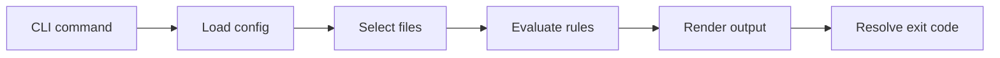

# Promptinel Onboarding

This guide is for contributors who want a reliable mental model of the repository before
they start changing code. It stays intentionally high level so routine implementation
changes do not make it obsolete.

## Start With The Product

Promptinel scans machine-interpreted natural language before an LLM or agent executes it.
The project is built around a few stable ideas:

- prompt content should be reviewed like executable input
- detection should be deterministic and CI-friendly
- rule behavior should be explicit, testable, and explainable
- trust and environment assumptions should shape detection

If you are new to the repository, read the [README](../README.md) first, then use the
[Documentation Index](./README.md) to go deeper where needed.

## The Mental Model

The easiest way to understand Promptinel is as a pipeline:



Most implementation details fit somewhere in that flow.

## Repository Shape

The repository has a small set of durable areas:

- `cmd/` contains the CLI surface and flag handling
- `internal/` contains the real behavior
- `docs/` explains user-facing and contributor-facing concepts
- `e2e/` contains end-to-end coverage for major workflows

Within `internal/`, the most important idea is separation of responsibilities. Configuration,
file collection, scanning, rules, reporting, and exit-code handling are kept distinct so the
CLI can stay thin and the core behavior can be tested directly.

## How To Approach A Change

When you make changes, start by placing the work in the right layer:

- CLI wording, flags, and command wiring belong in `cmd/`
- reusable behavior belongs in `internal/`
- rule logic belongs in the rule system, not in command handlers
- user-visible behavior changes should update documentation alongside tests

As a rule of thumb, `cmd/` should translate user input into internal requests and render the
result. Business logic should live elsewhere.

## The Main Workflows

### Scan

`scan` is the central workflow. It loads configuration, resolves effective rules, collects
files, evaluates findings, renders output, and maps the result to a process exit code.

If you are changing scan behavior, also look at:

- [Scan Pipeline](./ScanPipeline.md)
- [Configuration And Precedence](./Config.md)
- [Severity Handling](./Severity.md)
- [Trust Processing](./Trust.md)

### Sanitize

`sanitize` is narrower than `scan`. It performs safe, deterministic cleanup actions rather
than policy evaluation. If a change is about normalizing content instead of detecting risky
content, it probably belongs here.

### Baseline

Baseline support exists to make CI adoption practical. It lets teams accept an existing set
of findings, then focus on preventing regressions. Changes here should preserve deterministic
matching and clear operator expectations.

### Rules

Built-in rules are the heart of Promptinel. Each rule should have a clear purpose, stable
metadata, targeted tests, and matching documentation in `docs/rules/`.

If you are adding or changing a rule, read [Rule Architecture](./Rules.md) and the
[Rule Documentation Overview](./rules/Overview.md) before you start.

## Trust, Capabilities, And Severity

Three concepts come up repeatedly in the codebase. They are separate on purpose. 
It makes the scanner easier to reason about and less surprising to configure.

### Trust

The provenance of the content being analyzed. Lower-trust regions are scrutinized more
aggressively.

### Environment Capabilities

Whether the modeled runtime can execute shell commands, access the filesystem, access the
network, or reach secrets. Some detections only matter if the environment can actually carry
out the risky action.

### Severity

How strongly a finding should affect review and policy enforcement.

## In-Depth Documentation

Not every document matters for every change. Use the docs by task:

- [README](../README.md) for first use and quick orientation
- [Documentation Index](./README.md) for the full map
- [Architecture](./Architecture.md) for package boundaries
- [Scan Pipeline](./ScanPipeline.md) for scan behavior
- [Configuration And Precedence](./Config.md) for config resolution
- [Trust Processing](./Trust.md) for trust behavior
- [Severity Handling](./Severity.md) for policy impact
- [Rule Architecture](./Rules.md) for rule implementation work
- [Rule Documentation Overview](./rules/Overview.md) for the built-in rule catalog

## Local Development

The repository provides a Docker-backed development environment for Make targets such as
`make test`, `make lint`, and `make build`. Start that environment with:

```bash
make setup
```

If you have a compatible Go toolchain locally, you can also exercise the CLI directly:

```bash
go run main.go --help
go run main.go scan .
go run main.go rules list
```

For repository-level task discovery:

```bash
make help
```

Before opening a pull request, run the full local check set:

```bash
make fmt fix vet vuln lint test
```

## Testing Expectations

Promptinel cares about deterministic behavior, so tests are not only about detection
coverage. They also protect ordering, precedence, reporting, and command behavior.

Keep these boundaries in mind:

- `cmd` tests cover command behavior
- reusable logic should be tested in `internal/...`
- rule changes should come with focused rule tests
- behavior changes should update docs in the same change

## A Good First Reading Path

If you only have a short window to get oriented, read in this order:

1. [README](../README.md)
2. [Documentation Index](./README.md)
3. [Architecture](./Architecture.md)
4. [Scan Pipeline](./ScanPipeline.md)
5. whichever concept doc matches the area you want to change

That is usually enough context to start making useful changes without reading the entire
repository first.
