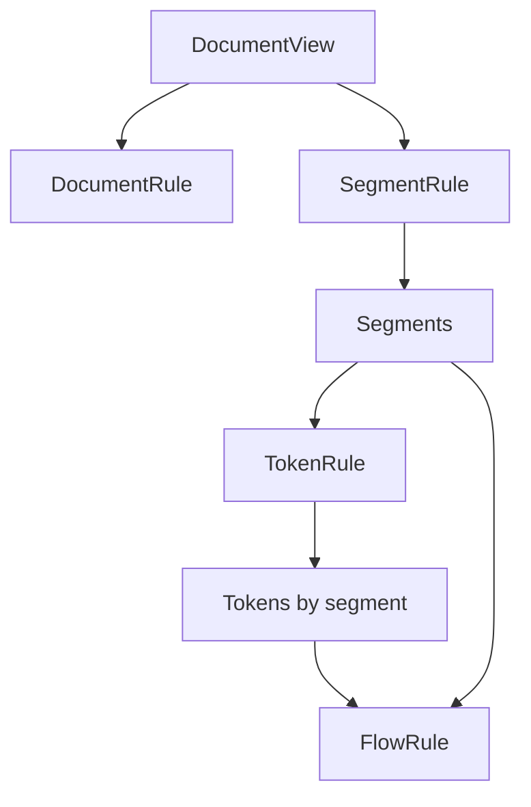
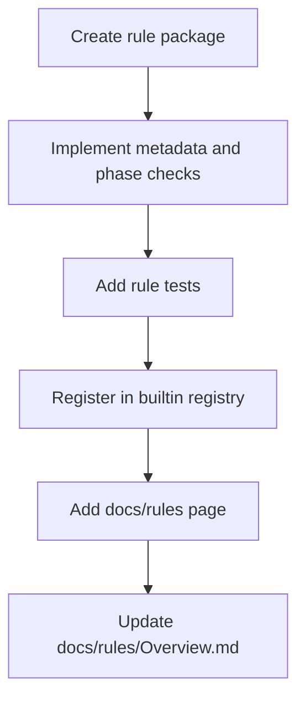

# Rule Architecture

This document explains how Promptinel rules are modeled, how they are evaluated, and how to add
new ones. For rule-specific user guidance, see [Rule Documentation Overview](./rules/Overview.md).

## Rule Model

Every rule implements the base `rules.Rule` interface by exposing metadata:

- stable `ID`
- human-facing `Name`
- `Summary`
- `Description`
- default severity

Built-in rules are compiled into the binary. Custom rules are loaded from configuration and
compiled at startup.

## Evaluation Phases

Promptinel supports four rule phases:

- `DocumentRule`
- `SegmentRule`
- `TokenRule`
- `FlowRule`

They run in deterministic order:

1. document checks
2. segment checks
3. token checks
4. flow checks

The evaluator builds the more expensive intermediate structures lazily. A document that only uses
document rules does not pay for segment or token analysis.



## What Each Phase Sees

### Document Rules

Document rules receive the whole normalized file as a single `DocumentView`. Use this when the
pattern is easiest to detect from complete file context.

### Segment Rules

Segment rules receive structural chunks produced by Promptinel's segmenter. Use this when the rule
needs a boundary between plain text and template-like regions.

### Token Rules

Token rules receive lexical tokens for a segment. Use this when the detection depends on concrete
token boundaries, placeholder detection, or operator-like syntax.

### Flow Rules

Flow rules receive the analyzed document with segments and tokens together. Use this when the rule
needs to reason across multiple signals, windows, or segments.

## What Rules Return

Rules return `[]rules.Finding` values with:

- a message
- a position

Rules do not set the final rule ID or effective severity themselves. The compiled rule wrapper
attaches those values after evaluation, which keeps metadata and overrides centralized.

## Rule Context

Every phase receives the same immutable `rules.Context`, which includes:

- relative file path
- environment capability flags
- base document trust level
- trust spans for lower-trust regions
- optional `SKILL.md` context metadata

That gives rules access to:

- environment-aware checks such as shell, filesystem, network, and secrets capabilities
- trust-aware checks over exact byte ranges
- repository-aware skill-resource checks when scanning `SKILL.md`

## Built-In Rules

Built-in rules are registered in `internal/rules/builtin/registry.go`.

Registration does three things:

1. makes the rule available to scans
2. exposes it to `promptinel rules list`
3. links it to a documentation file in `docs/rules/`

The registry rejects:

- empty rule IDs
- invalid default severity values
- duplicate rule IDs
- rules that do not implement at least one evaluation phase

## Custom Rules

Promptinel also supports config-defined custom regex rules under `custom-rules`.

Current behavior:

- they are compiled at startup from configuration
- they run as token-based regex matchers
- their metadata is generic rather than rule-specific
- they are not included in `promptinel rules list` or `promptinel rules describe`

Custom rules are useful for repository-specific or organization-specific patterns that do not need a
new built-in implementation.

## How To Add A New Built-In Rule

The current implementation path is:

1. Create a package under `internal/rules/builtin/` for the rule.
2. Implement `Metadata()` and at least one phase method.
3. Add focused tests for the rule package.
4. Register the rule in `internal/rules/builtin/registry.go`.
5. Add the rule documentation page in `docs/rules/`.
6. Update [Rule Documentation Overview](./rules/Overview.md).

Follow the existing pattern of keeping command behavior in `cmd/` and detection logic in
`internal/rules/...`.



## Choosing The Right Phase

Use the simplest phase that correctly models the behavior:

- prefer `DocumentRule` for compact whole-file pattern checks
- prefer `SegmentRule` when segment boundaries matter
- prefer `TokenRule` when matching depends on tokenization
- prefer `FlowRule` only when the rule genuinely needs multi-signal or cross-segment reasoning

Starting with an unnecessarily powerful phase makes the rule harder to understand and test.

## Testing Expectations

New built-in rules should have targeted tests that cover:

- metadata
- positive matches
- representative negative cases
- trust-aware behavior when applicable
- environment-aware behavior when applicable

If the rule changes the built-in catalog, its documentation must ship in the same change so
`rules list`, `rules describe`, and the docs stay aligned.

## Smallest Useful Custom Rule

If you do not need a new built-in rule, a custom regex rule is often enough:

```yaml
custom-rules:
  - id: blocked-domain-reference
    pattern: "\\b(?:evilcorp\\.example|staging-share\\.example)\\b"
    severity: high
    message: "Prompt references a blocked external domain"
```

That path is faster, but it is intentionally less expressive than a built-in Go rule.
