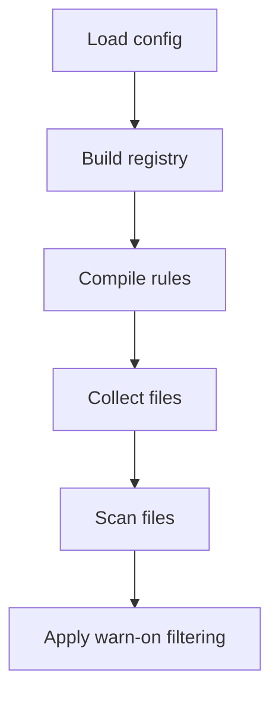
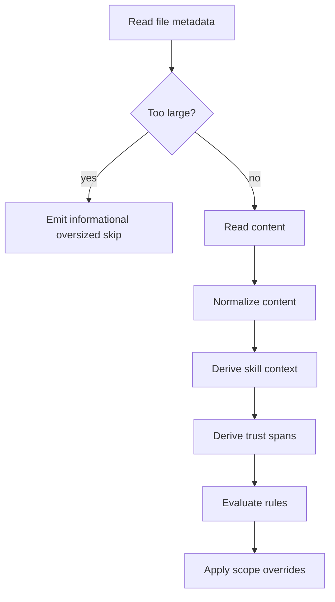
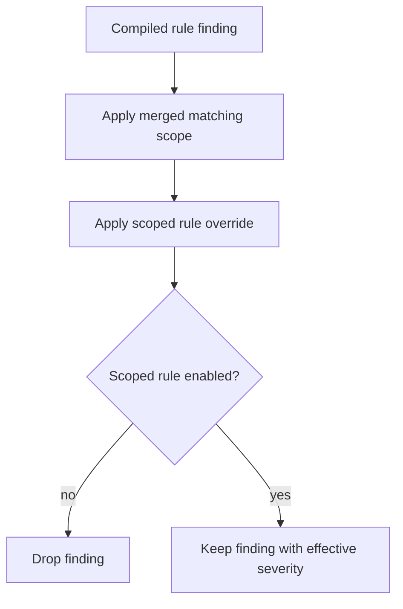

# Scan Pipeline

This document explains the implemented scan flow from CLI input to final report output.
It also notes where the public library reuses the same detection path for in-memory
content.

## High-Level Flow

`promptinel scan` and the baseline commands share the same core scanning pipeline up to the
point where raw and reportable findings have been computed:

1. load configuration
2. build the rule registry
3. compile built-in and custom rules
4. collect target files
5. scan files concurrently
6. apply policy filtering

## Configuration And Rule Compilation

The shared `internal/scan.Run` entry point:

- loads defaults and optional config discovery
- builds the built-in registry through `builtin.NewRegistry`
- applies config-driven rule enablement and severity overrides
- compiles custom regex rules from `custom-rules`

At the end of this stage, Promptinel has a fixed list of compiled rules for the scan.

The public library follows the same rule compilation path when
`pkg/promptinel.NewScanner(...)` is called, but it does so from an explicit in-memory
config instead of CLI config discovery.

## File Collection

The engine collects target files from the requested paths using include and exclude globs.

Unreadable paths discovered during collection are converted into low-severity findings rather than
hard scan failures. That keeps output deterministic and makes skips visible to the user.

## Per-File Processing

For each file, the engine:

1. checks file size against `limits.max_file_size_bytes`
2. reads file content
3. normalizes content for scanning
4. derives optional `SKILL.md` context
5. derives trust spans
6. evaluates compiled rules
7. applies scope overrides to the resulting findings

Oversized files are reported as informational skip findings and do not affect policy outcome.

## In-Memory Document Processing

The public library uses the same engine for in-memory content through a document-level
entrypoint.

For each document, the engine:

1. checks content size against `limits.max_file_size_bytes`
2. normalizes content for scanning
3. derives optional `SKILL.md` context when a path is provided
4. derives trust spans
5. evaluates compiled rules
6. applies scope overrides when `Document.Path` matches configured scopes

The library returns raw findings directly. It does not apply `policy.warn-on`, baseline
suppression, report rendering, or exit-code resolution.

## Deterministic Concurrency

Files are scanned with a bounded worker pool derived from `GOMAXPROCS`, but output order stays
deterministic:

- target files are indexed before dispatch
- worker results are stored by original index
- final findings are emitted in the same logical target order
- findings inside a file are sorted by rule ID, line, column, and message

This keeps CI output stable without giving up concurrency.

## Scope Resolution

Scopes are applied after rule evaluation, not during rule execution.

For a given file:

- all matching scopes are merged in declaration order
- later matches override earlier matches
- a scope-wide severity override applies to all findings in that file
- a scoped per-rule override can further override or disable one rule

Effective severity precedence for a finding is:

1. compiled rule severity
2. effective scope severity
3. effective scope rule severity

If a matching scoped rule sets `enabled: false`, the finding is dropped.

## Policy Filtering

The shared scan pipeline splits engine output into:

- `RawFindings`
- `ReportableFindings`
- `OversizedSkippedFindings`

`ReportableFindings` includes only findings at or above `policy.warn-on`, except oversized-file
skips, which are kept separate and always informational.

This same shared pipeline is used by `scan` and by `baseline create|update`.
The public library stops before this stage and returns raw findings from the engine.

## Command-Specific Post-Processing

After `internal/scan.Run` returns, commands diverge:

- `promptinel scan` may apply baseline suppression, then renders text/JSON/SARIF output, then
  resolves the final exit code
- `promptinel baseline create|update` builds a baseline snapshot from `RawFindings`, writes the
  snapshot file, and renders baseline summary text

## Baseline Behavior

Baseline commands use `RawFindings` to build or update the baseline snapshot.

`promptinel scan --baseline ...` applies the baseline only after the `warn-on` filter has already
produced reportable findings. Accepted findings are removed before text, JSON, or SARIF output is
written and before the final exit code is resolved.

## Exit Codes

The final `scan` command resolves process status from the highest remaining reportable severity:

- `0`: pass
- `1`: warn
- `2`: fail

That calculation happens after baseline suppression, so accepted findings do not continue to affect
CI results.
