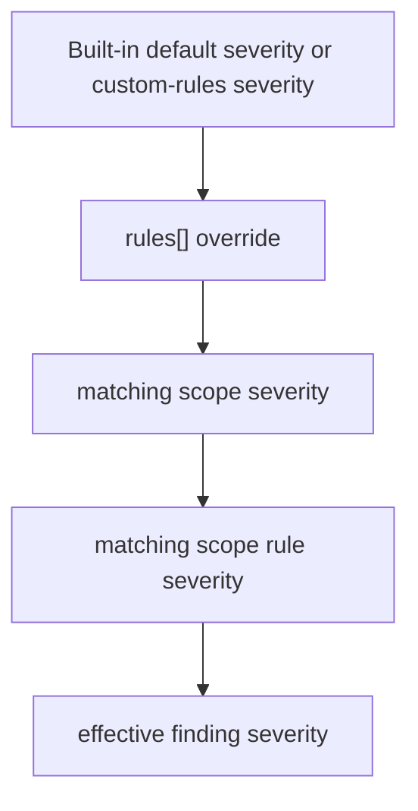
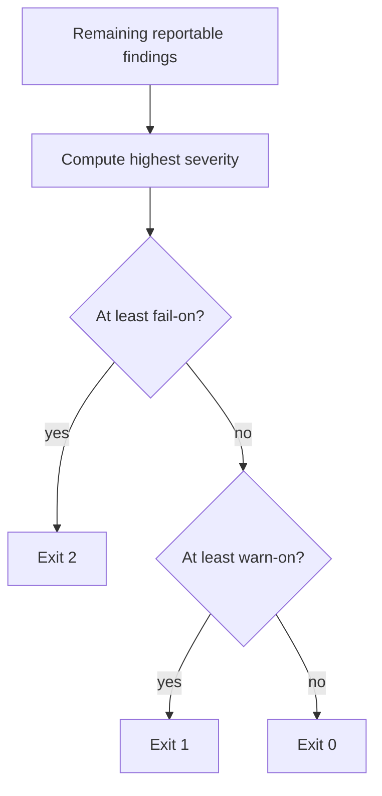

# Severity Handling

This document explains how Promptinel assigns, overrides, filters, and enforces severity.
For the full scan lifecycle, see [Scan Pipeline](./ScanPipeline.md).

## Severity Levels

Promptinel uses three severity levels:

- `low`
- `medium`
- `high`

They are ordered as:

```text
low < medium < high
```

This ordering is used for rule ranking, policy thresholds, and exit-code resolution.

## Where Severity Comes From

Every finding has an effective severity. That value can come from several places.

### 1. Rule Default Severity

Built-in rules define a default severity in rule metadata. Custom regex rules define their
severity in `custom-rules`.

### 2. Global Rule Overrides

Configuration under `rules[]` can:

- disable a built-in rule
- replace its default severity

This happens during rule compilation, before scanning starts.

### 3. Scope-Level Overrides

Configuration under `scopes[]` can override severity for files whose paths match the scope.

Promptinel merges all matching scopes in declaration order. Later matches override earlier ones.

### 4. Per-Rule Scope Overrides

Inside a matching scope, `scopes[].rules[]` can override or disable a specific rule for that path.

This is the most specific severity override in the current model.

## Effective Severity Precedence

For built-in rules, the effective severity for a finding is resolved in this order:

1. built-in rule default severity
2. `rules[].severity`
3. matching scope `severity`
4. matching scope rule override `scopes[].rules[].severity`

For custom regex rules, the starting point is the severity defined in `custom-rules[]`, followed by
the same scope-based overrides when the finding is attached to a matching file.



## How Severity Affects Reporting

The shared scan workflow produces three relevant sets of findings:

- `RawFindings`: everything emitted by the engine
- `ReportableFindings`: findings at or above `policy.warn-on`, excluding oversized-file skips
- `OversizedSkippedFindings`: informational skip diagnostics reported separately

Important details:

- oversized-file skips are always informational and do not participate in normal severity filtering
- unreadable-file skips are always surfaced as informational skip diagnostics and do not participate
  in normal severity filtering

## How Severity Affects Baselines

Baseline snapshots are built from `RawFindings`, not from `ReportableFindings`.

That means accepted low-severity findings can still be tracked in the baseline file even when the
current `warn-on` threshold would hide them from normal scan output.

When `promptinel scan --baseline ...` is used, baseline suppression happens after the normal
`warn-on` filter and before the final report and exit code are computed. Current baseline snapshots
match findings by stable identity and occurrence count, so routine line movement does not
immediately re-open accepted findings.

## How Severity Affects Exit Codes

`promptinel scan` resolves the final process outcome from the highest severity among the remaining
reportable findings:

- no findings: exit `0`
- highest severity at or above `policy.fail-on`: exit `2`
- otherwise, highest severity at or above `policy.warn-on`: exit `1`
- otherwise: exit `0`

With the default policy:

```yaml
policy:
  fail-on: high
  warn-on: medium
```

This means:

- only `high` findings fail the process
- `medium` findings warn
- `low` findings are not reportable unless policy is lowered



## Severity Design Intent

Severity is not a confidence score and not a trust level.

- severity expresses how strongly Promptinel wants the finding to affect review and policy
- trust expresses the provenance sensitivity of the content being analyzed
- confidence is implicit in each rule design and its severity rationale, but it is not modeled as a
  separate numeric field today
