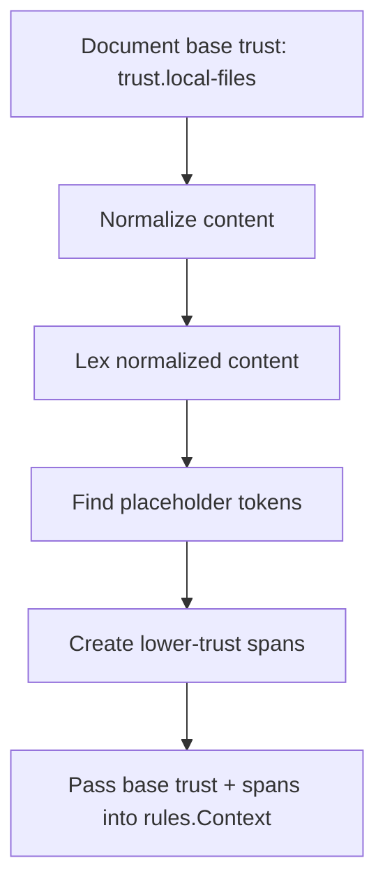
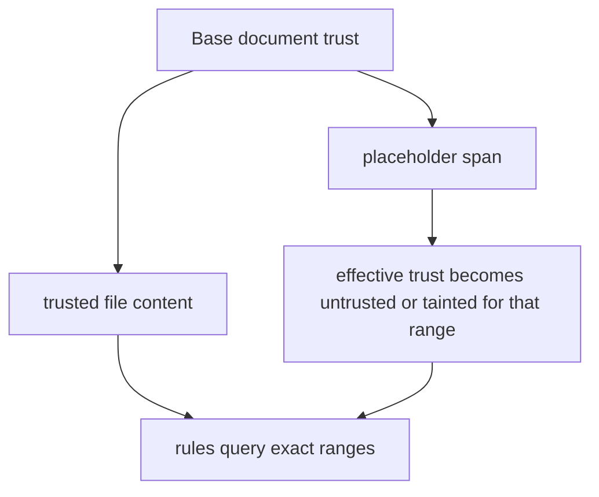

# Trust Processing

This document explains how Promptinel turns trust configuration into rule evaluation behavior.
For the broader runtime flow, see [Architecture](./Architecture.md) and
[Scan Pipeline](./ScanPipeline.md).

## Trust Levels

Promptinel uses three trust levels:

- `trusted`
- `untrusted`
- `tainted`

Trust is ordered from least restrictive to most restrictive:

```text
trusted < untrusted < tainted
```

That ordering matters because Promptinel always keeps the lower-trust interpretation when multiple
sources apply to the same content.

## Trust Sources

The configuration model exposes trust for three input sources:

- `trust.local-files`
- `trust.remote-includes`
- `trust.user-input-placeholders`

The default configuration is:

```yaml
trust:
  local-files: trusted
  remote-includes: untrusted
  user-input-placeholders: tainted
```



## How Trust Is Applied Today

Current scanner execution starts with one base trust level for the whole document:

- local files use `trust.local-files`

It then overlays lower-trust spans for placeholder regions detected in the normalized content:

- placeholder tokens inherit the more restrictive of `trust.local-files` and
  `trust.user-input-placeholders`
- only placeholder spans are materialized today
- `trust.remote-includes` is part of the configuration model, but it is not yet converted into
  scanner spans by the current engine

This gives Promptinel a mixed-trust model without requiring every file to be entirely trusted or
entirely tainted.

## Trust Overlay Model

Promptinel models trust as a base document level with optional lower-trust overlays:



## Processing Model

At scan time, the engine does the following for each file:

1. Load the base trust level from configuration.
2. Normalize the file content for scanning.
3. Lex the normalized content.
4. Find placeholder tokens.
5. Create trust spans for those placeholder byte ranges when their effective trust is lower than
   the base document trust.
6. Pass both the base trust level and the spans into `rules.Context`.

Trust is monotonic. A span may lower trust for a region, but it never raises trust above the base
document level.

## How Rules Query Trust

Rules do not need to reimplement trust merging. They receive helper methods on `rules.Context`,
including:

- `IsUntrusted()`
- `EffectiveTrustAt(...)`
- `EffectiveTrustRange(...)`
- `IsUntrustedAt(...)`
- `IsUntrustedRange(...)`
- `IsTaintedAt(...)`
- `IsTaintedRange(...)`

That lets a rule ask whether the exact bytes it is inspecting cross a lower-trust region.

## What Trust Changes In Detection

Trust does not change file selection, reporting format, or exit codes directly. It changes what a
rule considers suspicious.

Examples from the current rule set:

- some rules expand phrase matching in untrusted or tainted regions
- some flow rules allow broader distance windows when the inspected range crosses lower-trust spans
- placeholder-specific rules fire only when the placeholder region is effectively untrusted or
  tainted

The effect is intentionally conservative: content that comes from a weaker provenance should be
scrutinized more aggressively than hand-authored, trusted prompt text.

## What Trust Does Not Mean

In Promptinel, trust is an analysis input, not an allowlist.

- `trusted` does not mean safe
- `tainted` does not mean automatically blocked
- trust does not override rule severity
- trust does not suppress findings

It is one dimension of context that rules can use to make better decisions.
